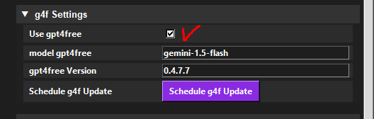
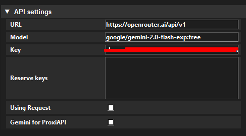
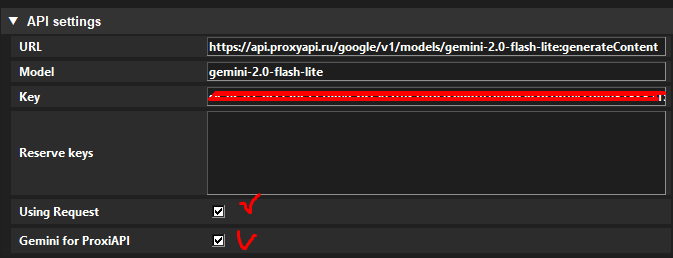
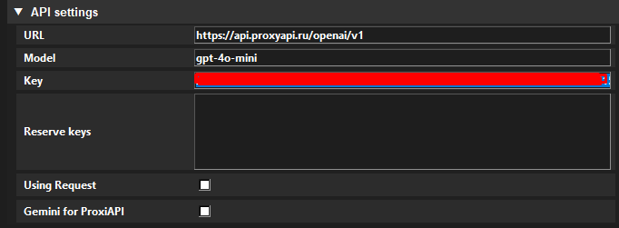
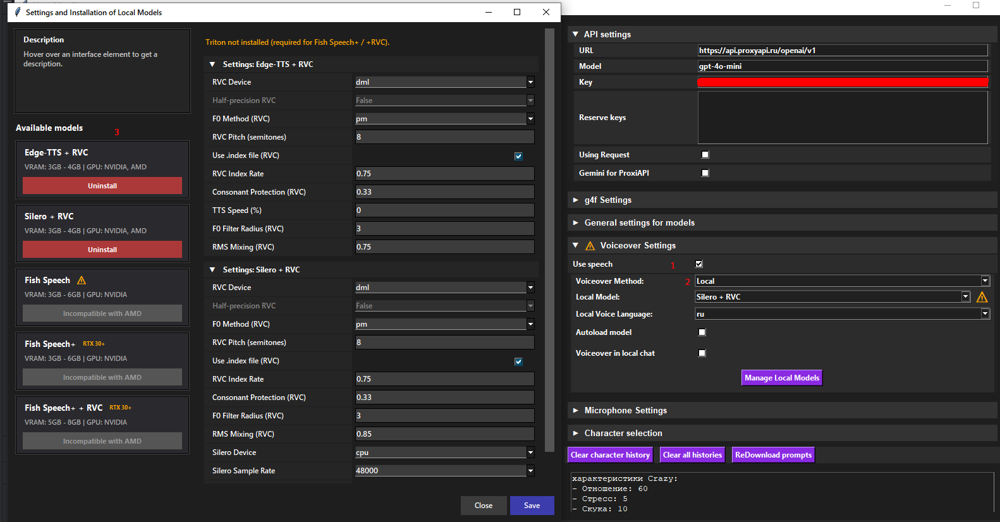

# НейроМита v0.011
Мод, в котором вам предстоит общаться с Митами управлямыми нейронными сетями. Сделано на Python и C# MelonMod.

Translation (deepseek) [English readme](README_EN.md)

Внимание, требуются c# unity разработчики (начинающие и выше), помощник аниматора, если что пишите сразу в лс дискорд vinerx!

Сервер Мода: https://discord.gg/Tu5MPFxM4P <- Здесь вам помогут)

# Инструкция по установке

### 0) Мелон лоадер:
Универсальный инструмент моддинга юнити, могут быть конфликты с модами на bepinEx.

- Либо тут через ставите https://melonwiki.xyz/#/?id=requirements 0.6.6 Версию.
- Либо тут ищите https://github.com/LavaGang/MelonLoader напрямую.

Есть файл MelonLoader.Installer.exe?
Отлично, выбирайте там мисайд, он его пропатчит, чтобы моды на основе мелона могли работать.
Не забудьте, у Мелона могут быть неустановленные у вас зависимости, например Net 6.0, перепроверьте их https://melonwiki.xyz/#/?id=requirements

### 1) Мод
Мод идет в комплекте а) файлы питона(их ставьте где угодно вместе) и б) файлы c# MitaAI.dll и assetbudle.test непосредственно в папку mods, 
созданную мелоном (вроде в релизы кинул). Итоговая структура должна выглядеть так:

    Miside
    - Другие Папки мисайда
    - Mods (При необходимости создать)
      - MitaAI.dll
      - assetbundle.test

    Любая Отдельная Папка
    - _internal
    - libs
    - Prompts
    - NeuroMita.exe
    Если нужна локальная озвучка, то там же:
    - Models
    - features.env

https://github.com/VinerX/NeuroMita/releases - тут релизы, то есть файлы которые нужны обычному игроку.

Кнопка чтобы начать писать в игре - Tab! Чтобы отправить - Enter.

### 2) Генерация текста
Мод в плане генерации текста можно запустить в нескольких форматах. Говорится о форматах, которые в той или иной мере тестировались.
#### Основные
   - API Бесплатно:
     - используя галку g4f
     - используя бесплатные ключи опенроутер https://openrouter.ai/settings/keys. У аккаунтов опенроутера есть лимиты (в минуту, дневные).
     - используя бесплатные ключи io.net https://ai.io.net/ai/api-keys - лимиты: 500к токенов в день на модель.
   - API Платно 
     - (РФ) оплачивая ключ здесь https://console.proxyapi.ru/billing , промокод NEUROMITA на 25% скидки в первый раз. Стабильно, но учитывайте расход.
     - Openrouter с оплатой, очень большой список моделей, оценить предлагаю самим.
   - Локально
     - технически пробовалось через LM Studio https://lmstudio.ai, но имейте ввиду, нужно железо, и скорее всего оно будет слабее доступных нейронок на сотни миллиадров параметров. Гайда не будет, так как рассчитано на опытных пользователей.

   Внимание, чаще всего модели gemini лучше справляются с передачей эмоций, так что обычно интересней играть с ними. Дипсик чуть хуже (но умнее обрабатывает команды), гпт (4о) пресноват.

### Модели для генерации (на 05.05.2025)

   Внимание, в мире нейронных сетей все очень быстро меняется, и к моменту вашего прочтения какие-то могут устареть, а какие-то не успеть войти в список.
   Следите за новостями в дискорд сервере)
  
 Сейчас пойдут настройки, которые нужно прописать в запущенном приложении exe (чат боте)
   
### G4F
Вариант без ключей, хорош для тестрования, но модели слабее.
     

 Надо ставить галку на использование (оно будет использоваться вместо основных настроек). 
 Можно менять версии биоблиотеки используя ввод версии и кнопку (нужен перезапуск).

 - модель gemini-1.5-flash (Одна из самых стабильных на 0.4.7.7)
 - модель gpt-4o-mini
 - модель gpt-4o
 - модель gemini-2.0-flash
 - модель deepseek-chat
 - Полный список:  https://github.com/xtekky/gpt4free/blob/main/docs/providers-and-models.md#providers-no-auth-required
   
### OpenRouter

Вариант с ключами, как бесплатными так и платными

   Модели OpenRouter, ссылка ключи https://openrouter.ai/api/v1 тут получаем https://openrouter.ai/settings/keys

  - модель google/gemini-2.0-pro-exp-02-05:free
  - модель deepseek/deepseek-chat:free - Рекомендуется для Доброй Миты
  - модель deepseek/deepseek-chat-v3-0324:free оно хардкорное)

Полуплатные - нужен баланс на счете, но не расходуется:
  - модель google/gemini-2.5-pro-exp-03-25:free

Полный список https://openrouter.ai/models?max_price=0

   
### ProxiApi: 
  Внимание, ВАМ НЕ НУЖЕН ПРЕМ ЗА 1500, можно просто пополнить баланс на 200 и более рублей. Промокод NEUROMITA на 25% скидки разово. 
  Модели от ProxyApi, выбраны так как нормально можно оплатить в рф. Ключи и цены здесь: https://console.proxyapi.ru/billing
  
  Обратите внимание на вид ссылки  моделей Gemini. Эти модели - самые дешевые. 
    
  - ссылка https://api.proxyapi.ru/google/v1/models/gemini-2.0-flash-lite:generateContent модель gemini-2.0-flash-lite
  - ссылка https://api.proxyapi.ru/google/v1/models/gemini-1.5-flash:generateContent модель gemini-1.5-flash
  
  Для GPT и DeepSeek ссылки имеют ввид по типу https://api.proxyapi.ru/openai/v1, галок не нужно:

  - ссылка https://api.proxyapi.ru/openai/v1 модель gpt-4o-mini (дороже)
  - ссылка https://api.proxyapi.ru/deepseek модель deepseek-chat (осторожно, еще дороже)

  Есть и другие модели, если вам позволяют финансы, но будьте аккуратны: https://proxyapi.ru/pricing/list
  
    
## 4) Генерация Голоса

Сейчас есть два варианта - используя ТГ ботов (и собственный акк) или же локально.

### Telegram 

Для юзания ТГ озвучек используется telegram api, то есть ваш акк (желательно не основной) превращается в бота, в том плане что им можно управлять из кода. Сделал так со своим, но оцените риски сами) Либо спросите у остальных.
Нужны api_id and api_hash, тут гайд как их получить: https://core.telegram.org/api/obtaining_api_id

Код исходный есть, риски я указал. 
Когда все введете, нужно будет перезапуститься и ввести код подтверждения, который придет на тг аккаунт.
Если есть облачный пароль, вводите его. Он невидимый, но есть ввести правильно и нажать ентер, то пройдет.

Есть два Бота для озвучки - @CrazyMitaAIbot (бесплатно, не всегда стабильно) и @silero_voice_bot (Платно, но есть 600 символов протестить)
В оба надо сначала вручную зайти. В ТГ же сможете м проверить, доходят ли ваши сообщения от мода. 
У силеро есть реферальная программа, можно так сколько-то дней себе получить бесплатно, поспрашивайте не сервере.

### Локальная озвучка
Требуется папка моделей и features.env, которые идут в релизе отдельной папкой. 
Внимание, в процессе установок моделей будут закачиваться до файлы - это будет занимать время в первый раз.
Также, каждый раз при смене моделей затрачивается время на инициализацию.

1) Включаем озвучку
2) Выбираем Local, доступно если добавили features.env. Можно в целом загрузить автоматом при наличии файлика, но может быть медленно.
3) Устаналиваем нужную модель, настраиваем.

   
Вы дочитали до сюда? Возьмите с полки пирожок))

Текущий состав разработчков:
- VinerX
- vlad2830 - работа по C# части 
- Nelxi (distrane25) - спасибо за помощь по внедрению голосового ввода на python

За коллосальеую работу по локальной озвучке (а также помощь по python) спасибо:
- _atm4x

За промпты персонажей спасибо: (им можно и нужно писать по вопросам и о доработкам логики ответа персонажей)
- Feanor (дис feanorqq) и Tkost: Добрая Мита
- Josefummi: Коротковолосая Мита
- gad991: Кепка
- depikoov: Мила

За трудоемкой работу (в процессе) по анимкам спасибо:
- JPAV

За пулл-реквесты и контакт CrazyMitaBot спасибо:
- スノー (v1nn1ty)

Спасибо и сомому проекту CrazyMitaBot - благодаря им озвучка становится доступней

Благодарности - напишу тут, чтобы потом не забыть никого:
- Sutherex - он показал мне openrouter, так что за работу с бесплатными ключами спасибо двойное ему. Помогал и помогает организационно, а также по теме нейроронок. А еще он сделал лого)
- Доктор Диванных Наук - был еще на заре, первый тестер еще только чат бота, помогал множеством советов и хороших идей. Админит)
- Романчо - помогает структурировать многочисленные задумки, чтобы потом их не забыть) А еще админит и отвечает на вопросы)
- FlyOfFly - очень полезные советы и наработки по юнити, даже ввод текста он мне помог в начале прикрутить)
- LoLY3_0 - Кот на арбузе)))
- Mr. Sub - его ролик скорее всего позволил вам узнать об этом моде) 
- Всем тестировщиком первых дней после выхода того ролика (Особенно smarkloker), это было конечно тягомотно) 

Также спасибо:
- KASTA 

Поддержать автора (VinerX), можно будет тут https://boosty.to/vinerx
 

